# Optical calculation and diameter-conversion workflow

[Rendered SVG](optical_workflow.svg) · [Editable Graphviz source](optical_workflow.dot)

This is a workflow diagram with the principal function calls, not an exhaustive
call graph. Arrows show processing order; the dashed link is the saved LUT
passed from construction to later use. RI means refractive index. PCHIP is a
shape-preserving piecewise cubic interpolation method.

```mermaid
flowchart LR
    subgraph A["(a) LUT construction"]
        direction TB
        T["OPC settings · TOML"] --> L["load_optical_setup()<br/>Read and validate geometry"]
        L --> B["build_setup_sigma_lut()<br/>→ build_sigma_lut()<br/>Select detector and D, n, k grids"]
        B --> C["setup_geometry_cache()<br/>→ channel_geometry_cache()<br/>Accepted angles and polarization weights"]
        C --> I["setup_csca()<br/>→ _collected_cross_section()<br/>Mie intensities × angular weights<br/>Integrate over solid angle; multiply by πr²"]
        I --> Z[("Saved LUT · Zarr<br/>Cross-sections and optical metadata")]
    end
    subgraph B2["(b) Diameter conversion"]
        direction TB
        R["SigmaLUT(path)<br/>Read and validate table"] --> D["convert_do_lut()<br/>Input edges and both refractive indices"]
        D --> Q["SigmaLUT.sigma_curve()<br/>Interpolate responses for both RIs"]
        Q --> S["make_monotone_sigma_interpolator()<br/>Log-space representatives → isotonic fit<br/>Collapse plateaus → PCHIP"]
        S --> M["Match equal scattering cross-section<br/>Calibration diameter → signal<br/>→ assumed-particle diameter"]
        M --> E["Converted bin edges<br/>Validate positivity and strict ordering"]
    end
    Z -.-> R
```



## Editing and exporting

- Edit the text inside the Mermaid block above to change the Markdown diagram.
  A Mermaid-enabled Markdown preview renders it; an ordinary text editor shows
  its source. `-->` creates an arrow and `-.->` creates a dashed arrow.
- `optical_workflow.dot` is the editable source for the accompanying rendered
  figure. It uses Graphviz for more controlled placement. The Mermaid and DOT
  versions are separate sources; editing one does not automatically edit the other.
- Re-render the DOT source from this directory:

```sh
dot -Tsvg optical_workflow.dot -o optical_workflow.svg
dot -Tpng -Gdpi=180 optical_workflow.dot -o optical_workflow.png
```

SVG is a vector image, so its lines and text remain sharp when resized. It can
also be edited in a vector drawing application. Keep the source alongside it.

## Suggested supplementary caption

Figure Sx. Main steps and function calls used to construct optical-response
lookup tables (LUTs) and convert optical diameters. (a) Instrument geometry,
laser polarization, and collection settings are read from a TOML configuration
file. The model integrates polarized Mie scattering over the accepted solid
angle and stores the resulting cross-sections on diameter and complex
refractive-index grids, together with the optical configuration. (b) During
diameter conversion, the stored responses are interpolated for the calibration
and assumed particle refractive indices and made strictly monotone. Each input
diameter is mapped to the diameter giving the same scattering cross-section
for the assumed refractive index. The dashed connection denotes reuse of the
saved LUT; optical integration is not repeated during diameter conversion.

## Scope notes

The geometry cache is prepared by the LUT builder and passed to `setup_csca`;
the cache itself does not call the integrator. The diagram shows this processing
order, rather than claiming every consecutive box calls the next box.
The fixed calibration response may be prepared once and reused. Concentration
adjustment after edge conversion is outside this diagram. The routine conversion
does not read today's TOML or rebuild Mie responses.
