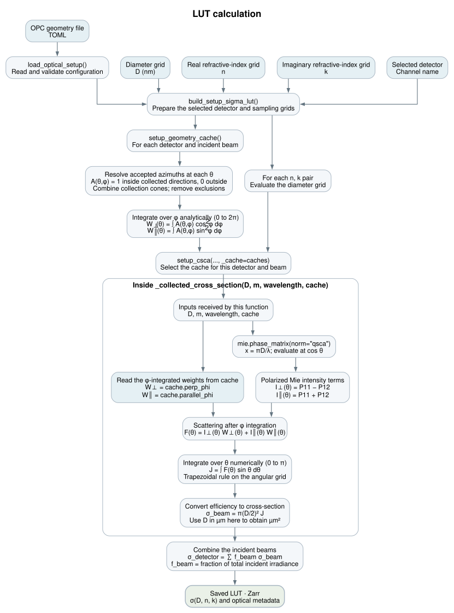
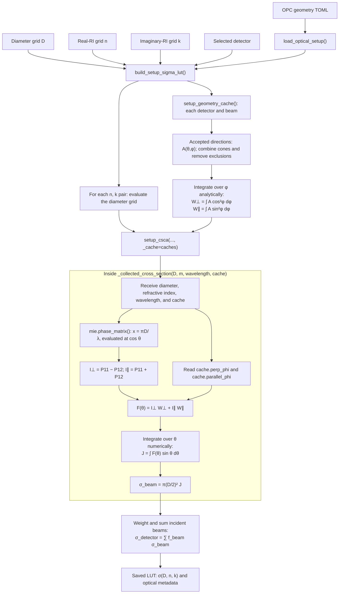
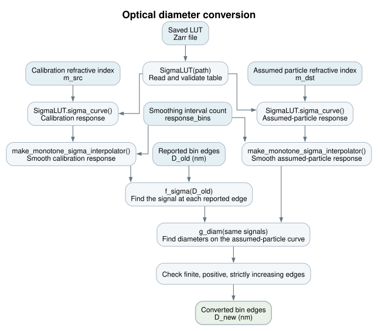
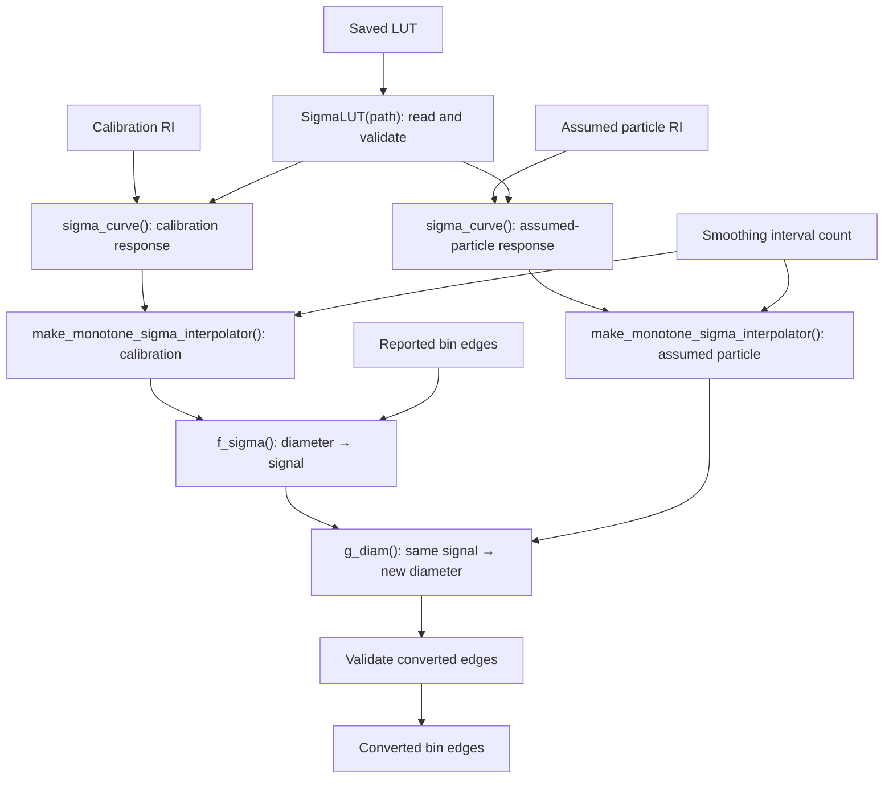

# Optical workflows

These are two separate workflows. Blue boxes identify independent inputs;
green boxes identify outputs. Arrows show processing order or data dependencies,
not an exhaustive graph of direct function calls. RI means refractive index.

## 1. LUT calculation



[Editable Graphviz source](optical_lut_workflow.dot)

The geometry file includes wavelength, beam direction and polarization,
collection/exclusion cones, and angular spacing. Diameter, real-RI, and
imaginary-RI grids are separate build inputs, not geometry settings.
The selected detector is also an explicit build input.



### Where the two angular integrations happen

For one detector and one beam, the full collected cross-section is

\[
\sigma_{\mathrm{beam}} = \pi r^2
\int_0^\pi\int_0^{2\pi}
A(\theta,\phi)
\left[I_\perp(\theta)\cos^2\phi
+ I_\parallel(\theta)\sin^2\phi\right]
\,\mathrm d\phi\,\sin\theta\,\mathrm d\theta.
\]

Here, \(A\) is the collection mask: one for accepted directions and zero for
uncollected or excluded directions. The solid-angle element is
\(\mathrm d\Omega=\sin\theta\,\mathrm d\theta\,\mathrm d\phi\).
The code measures φ from the beam's transverse reference direction toward its
electric-field direction. Thus cos²φ weights perpendicular polarization and
sin²φ weights parallel polarization in each ray's scattering plane.
These angles are defined separately for each incident beam.

The geometry cache first evaluates

\[
W_\perp(\theta)=\int_0^{2\pi}A(\theta,\phi)\cos^2\phi\,\mathrm d\phi,
\qquad
W_\parallel(\theta)=\int_0^{2\pi}A(\theta,\phi)\sin^2\phi\,\mathrm d\phi.
\]

These are `cache.perp_phi` and `cache.parallel_phi`. The integrals use exact
antiderivatives over the accepted φ intervals; the circular-cone and full-azimuth
special cases use equivalent closed-form weights. They can be reused across
diameters and refractive indices because they depend only on the optical setup.

The cache is an actual input to `_collected_cross_section`, not a separate step
applied after that function returns. The function boundary in the figure encloses
the Mie evaluation, use of φ weights, θ integration, and projected-area factor.
The relevant call and calculation are:

```python
# In setup_csca():
_collected_cross_section(d, m_particle, setup.wavelength_nm, cache)

# Inside _collected_cross_section():
phi_integral = perpendicular * cache.perp_phi + parallel * cache.parallel_phi
```

The scattering calculation supplies \(I_\perp=P_{11}-P_{12}\) and
\(I_\parallel=P_{11}+P_{12}\), combines them with those weights, and then
numerically integrates the remaining θ dependence. `norm="qsca"` means that
\(\int_{4\pi}P_{11}\,\mathrm d\Omega=Q_{\mathrm{sca}}\); multiplying by
\(\pi r^2\) gives the cross-section. Neither a second φ integral nor another
factor of \(2\pi\) should be added at that stage.

Finally, `setup_csca` adds beam contributions using their fractions of total
incident irradiance. Separate detectors remain separate outputs.

## 2. Optical diameter conversion



[Editable Graphviz source](optical_conversion_workflow.dot)

`convert_do_lut()` coordinates the query, smoothing, equal-signal mapping,
and edge-validation steps below. `SigmaLUT(path)` is initialized by the caller.
No TOML reading or new Mie integration is needed during conversion.



Smoothing uses log-space representatives, isotonic regression, plateau
collapse, and PCHIP (shape-preserving piecewise cubic interpolation).
The fixed calibration response can be prepared once and reused.
Concentration adjustment after edge conversion is outside this diagram.

## Editing and exporting

Edit the `.dot` files to change the rendered figures. From `docs/figures`, run:

```sh
dot -Tsvg optical_lut_workflow.dot -o optical_lut_workflow.svg
dot -Tsvg optical_conversion_workflow.dot -o optical_conversion_workflow.svg
```

The SVG files are vector artwork. For a PNG, replace `-Tsvg` with
`-Tpng -Gdpi=180` and change the output extension to `.png`.
The Mermaid blocks above are an alternative editable representation; they
do not automatically update the DOT files or SVG artwork.

## Suggested supplementary captions

**LUT calculation.** Independent inputs and principal steps used to construct
an optical-response lookup table. The instrument configuration is read from
TOML; diameter and complex refractive-index sampling grids and the selected
detector are supplied separately. The geometry calculation analytically
integrates the polarization projections over accepted azimuthal angles φ.
These cached weights are combined with the polarized Mie intensity terms;
the remaining θ integration includes the sin θ solid-angle factor. Multiplying
by particle projected area and combining incident-beam contributions gives
the detector cross-section, which is saved with the optical configuration.

**Optical diameter conversion.** Independent inputs and principal steps used
to convert reported optical bin edges. Responses for the calibration and
assumed particle refractive indices are obtained from the saved LUT and made
strictly monotone. Each reported diameter is mapped to the diameter on the
assumed-particle response giving the same scattering cross-section. The
conversion uses the saved LUT without repeating the optical integration.
