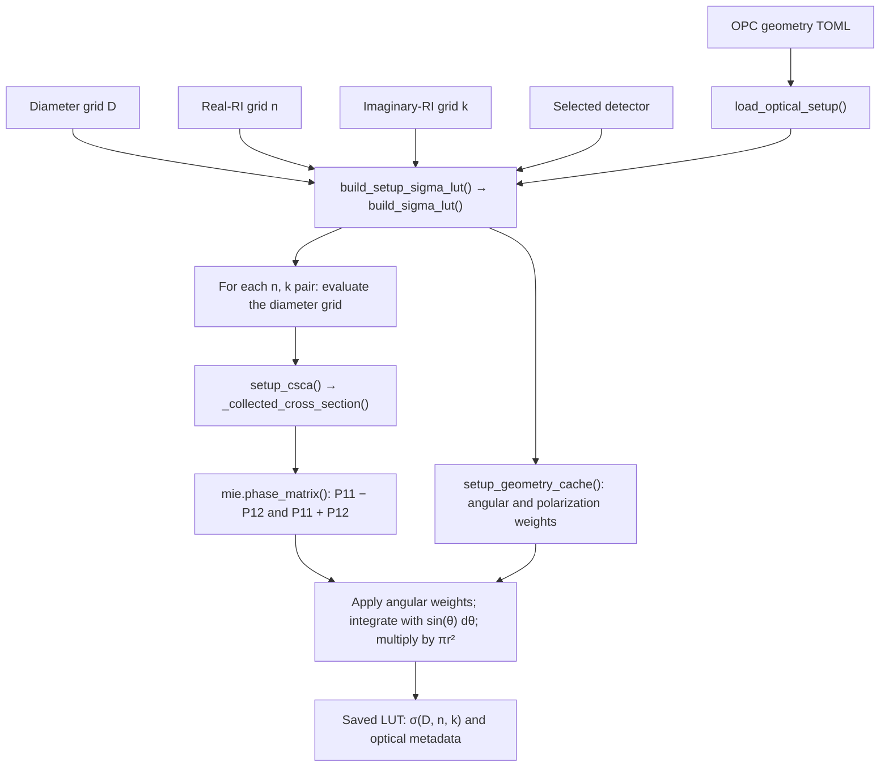
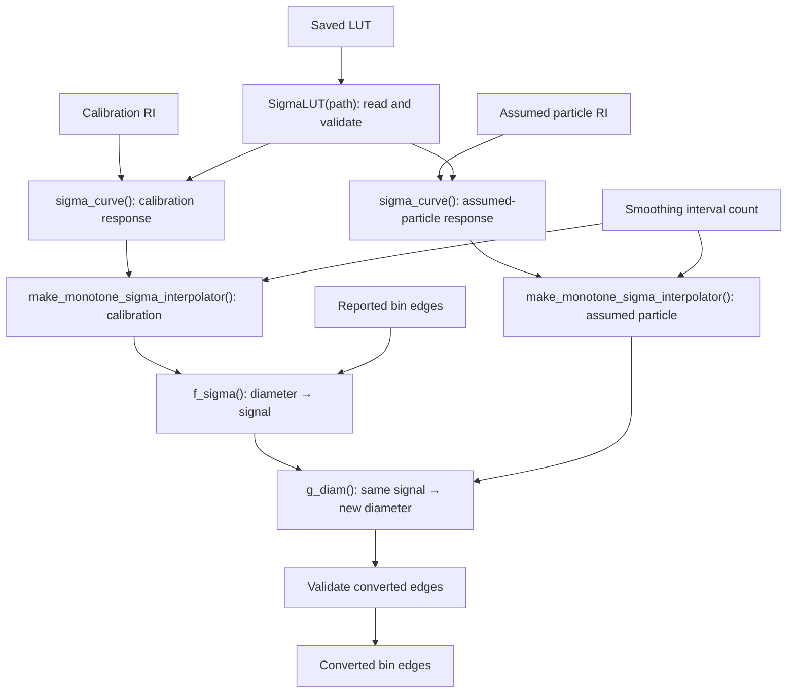

# Optical workflows

These are two separate workflows. Blue boxes identify independent inputs;
green boxes identify outputs. Arrows show processing order or data dependencies,
not an exhaustive graph of direct function calls. RI means refractive index.

## 1. LUT calculation


[Editable Graphviz source](optical_lut_workflow.dot)

The geometry file includes wavelength, beam direction and polarization,
collection/exclusion cones, and angular spacing. Diameter, real-RI, and
imaginary-RI grids are separate build inputs, not geometry settings.
The selected detector is also an explicit build input.



## 2. Optical diameter conversion


[Editable Graphviz source](optical_conversion_workflow.dot)

`convert_do_lut()` coordinates the query, smoothing, equal-signal mapping,
and edge-validation steps below. `SigmaLUT(path)` is initialized by the caller.
No TOML reading or new Mie integration is needed during conversion.



Smoothing uses log-space representatives, isotonic regression, plateau
collapse, and PCHIP (shape-preserving piecewise cubic interpolation).
The fixed calibration response can be prepared once and reused.
Concentration adjustment after edge conversion is outside this diagram.

## Editing and exporting

Edit the `.dot` files to change the rendered figures. From `docs/figures`, run:

```sh
dot -Tsvg optical_lut_workflow.dot -o optical_lut_workflow.svg
dot -Tsvg optical_conversion_workflow.dot -o optical_conversion_workflow.svg
```

The SVG files are vector artwork. For a PNG, replace `-Tsvg` with
`-Tpng -Gdpi=180` and change the output extension to `.png`.
The Mermaid blocks above are an alternative editable representation; they
do not automatically update the DOT files or SVG artwork.

## Suggested supplementary captions

**LUT calculation.** Independent inputs and principal steps used to construct
an optical-response lookup table. The instrument configuration is read from
TOML; diameter and complex refractive-index sampling grids and the selected
detector are supplied separately. Polarized Mie scattering is integrated over
the accepted solid angle, and the resulting cross-sections are saved together
with the optical configuration.

**Optical diameter conversion.** Independent inputs and principal steps used
to convert reported optical bin edges. Responses for the calibration and
assumed particle refractive indices are obtained from the saved LUT and made
strictly monotone. Each reported diameter is mapped to the diameter on the
assumed-particle response giving the same scattering cross-section. The
conversion uses the saved LUT without repeating the optical integration.
