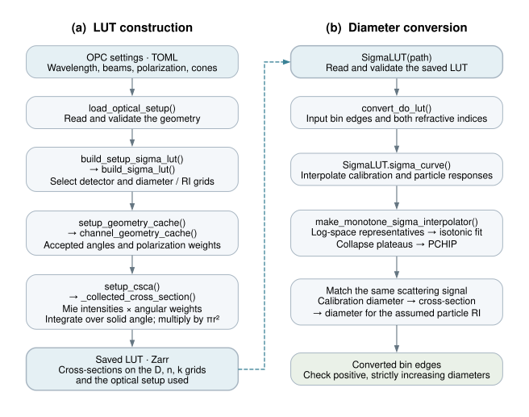

# Reading and configuring the optical code

## Workflow overview



The left column builds the lookup table (LUT); the right column uses that saved
table to convert diameters. Arrows show processing order, not an exhaustive
list of direct function calls. The dashed link shows reuse of the saved LUT.

[Mermaid diagram, editing instructions, and caption](figures/optical_workflow.md) ·
[Graphviz source for the rendered figure](figures/optical_workflow.dot) ·
[SVG figure](figures/optical_workflow.svg)

## Start with the calculation you need

The beginning of `src/optical_diameter.py` contains the main calculations.
Read the smaller helper functions below them only when you need more detail.

During a merge, the optical response has already been calculated:

```text
convert_do_lut
  ├─ SigmaLUT.sigma_curve: read/interpolate the two RI responses
  ├─ make_monotone_sigma_interpolator: smooth each response
  └─ reported diameter → source signal → target diameter at the same signal
```

RI means refractive index. This conversion changes only the diameters.
`utils.remap_dndlog_by_edges` separately adjusts the distribution heights
to preserve the number concentration in each converted bin.

When creating a LUT (lookup table), the path is different:

```text
load_optical_setup → checked beam directions and collection cones
build_setup_sigma_lut → setup_csca
  ├─ setup_geometry_cache: accepted directions and polarization weights
  └─ _collected_cross_section, for each diameter
       ├─ Mie matrix: perpendicular/parallel scattering intensities
       ├─ multiply by the accepted-direction weights
       ├─ integrate with sin(theta) dtheta
       └─ multiply by particle projected area → cross-section in um²
```

The geometry weights depend on the optics, not particle diameter or RI, so
they are calculated once and reused. Their existing integration grids and
normalization have not changed. The general setup keeps detector outputs
separate and weights beams by their fraction of total incident intensity.

## Files and responsibilities

- `src/optical_diameter.py`: scattering, monotone response, diameter conversion.
- `src/optical_geometry.py`: beams, collection/exclusion cones, validation,
  and the TOML loader. Instrument-specific settings also support explicit
  in-memory experiments with different angles or wavelengths.
- `src/optical_lut.py`: table building, disk access, and interpolation.
- `opc_setups/pops.toml`, `uhsas.toml`, `pcasp.toml`: commented instrument settings.

TOML is a plain-text settings format that allows comments. The files specify
wavelength in nm, angular step in degrees, directions as `[x, y, z]`, beam
intensity fractions, and accepted/blocked cones. Each cone's half-angle is
measured from its own axis, not necessarily from the laser. A detector accepts
the union of its collection cones, with all exclusion cones removed.

For the default forward beam, the laser is along z and the electric field
along x. Theta is measured from that beam; phi is measured from y toward x.
Angles for a reversed or rotated beam are measured in that beam's own frame.

## Use or edit a setup

```python
from sizedistmerge.optical_geometry import load_optical_setup
from sizedistmerge.optical_diameter import setup_csca
from sizedistmerge.optical_lut import build_setup_sigma_lut

setup = load_optical_setup("pops")
# Alternatively: setup = load_optical_setup("my_pops.toml")
cross_sections = setup_csca([100., 500., 1000.], 1.615 + 0.001j, setup)
print(cross_sections["Collection"])  # um², one value per diameter
```

Use the same `setup` object in the geometry drawing. The LUT builder records
the resolved setup in the LUT metadata. When drawing an **existing** LUT,
use `optical_setup_from_lut_metadata(lut_attributes)` instead of today's TOML:
editing a settings file must not relabel an older calculation as a new one.
The literature notes in TOML are for the reader; the numerical setup, rather
than those notes, is serialized into the LUT. Record extra provenance separately.

Unknown TOML fields are rejected, as are invalid directions, angles, and beam
fractions. Adding a new instrument normally needs a new TOML file, not a new
Mie integration function. Load its explicit path to try it.

The setup files do **not** specify campaign calibration RI, LUT sampling grids,
or merge weights. Those are separate choices in the build/run configuration.

## Imports and reproducibility

Import `SigmaLUT` and LUT builders from `optical_lut`, and geometry settings
from `optical_geometry`. The old instrument-specific scattering and cache
wrappers have been removed. For every instrument, use `setup_csca(setup=...)`
and `setup_geometry_cache(setup)`; choose the required named detector from
the returned dictionary. Parallel LUT building remains in `optical_lut`.

The no-argument preset factories load TOML. Passing an
explicit `POPSGeom`, `UHSASGeom`, or `PCASPGeom` instead retains the legacy
Python settings path; it intentionally does not read a TOML override.

This reorganization does not change the Mie equations, angular integration,
response smoothing, inverse calculation, or existing LUT contents. The default
TOML setups reproduce the legacy presets. No production restart or LUT rebuild
is needed solely because the code was reorganized.
